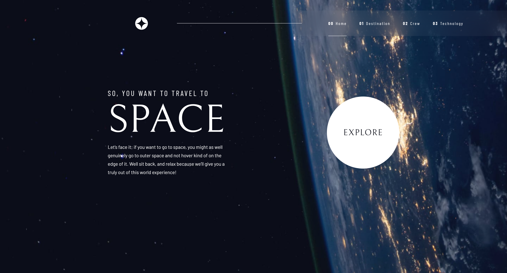

<h1 align="center">
  
</h1>

  

## 💻 Projeto

Esse projeto é um desafio tirado do site  [**Frontend Mentor**](https://www.frontendmentor.io/challenges/space-tourism-multipage-website-gRWj1URZ3). 
O site possui quatro páginas diferentes e para atingir o objetivo foi usado vue Router para troca dinamica de rotas entre cada uma delas.

## 🚀 Tecnologias

- [Vue JS](https://vuejs.org/)
- [Javascript](https://developer.mozilla.org/pt-BR/docs/Web/JavaScript)
- [SASS](https://sass-lang.com/)
- [CSS](https://developer.mozilla.org/pt-BR/docs/Web/CSS)
- [HTML](https://developer.mozilla.org/pt-BR/docs/Web/HTML)

